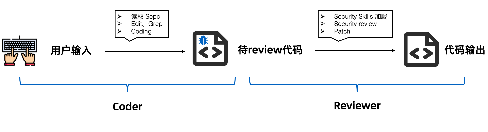
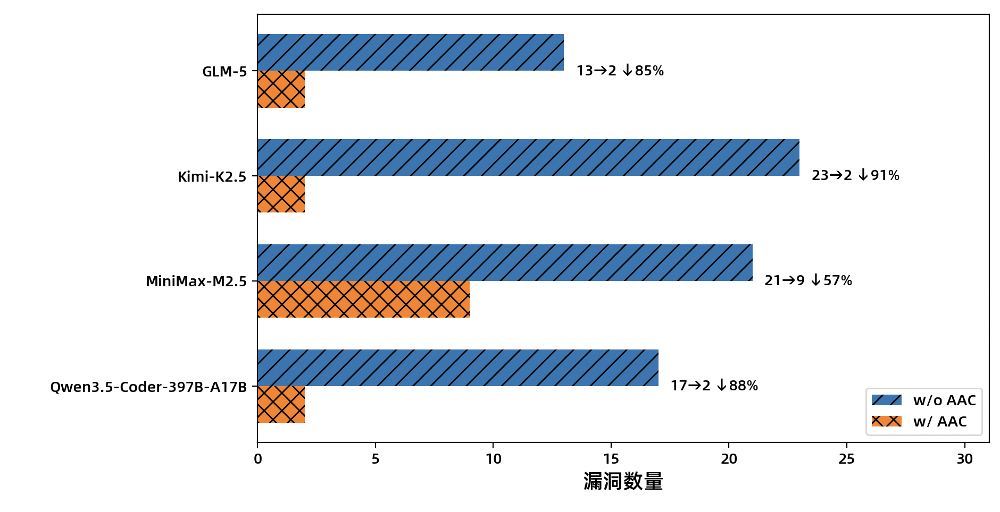

<p align="center">
  <h1 align="center">Adversarial AI Coding Plugin</h1>
  <p align="center"><b>Self-Play Sparring, Offense Meets Defense — Making AI Write Secure Code</b></p>
</p>

<p align="center">
  <a href="#benchmark-results">Benchmark</a> |
  <a href="#quick-start">Quick Start</a> |
  <a href="#roadmap">Roadmap</a> 
</p>

---

## The Problem: The Security Paradox of SOTA LLMs

LLMs are generating production code at an unprecedented pace, but that code harbors significant security risks. Published benchmarks show that even state-of-the-art commercial models **produce vulnerable code up to 48.2% of the time, with top-tier models ranging from 37% to 95.6%** (Source: AutoBaxBench, Dec 2025).

Paradoxically, these same SOTA LLMs excel at vulnerability discovery — Claude Opus 4.6 has uncovered hundreds of security vulnerabilities in open-source projects and even independently developed a full exploit chain for a FreeBSD kernel remote code execution vulnerability.

**Root cause:** When generating code, the LLM's optimization target is *functional correctness*, not *security*. Security is merely an implicit constraint that is easily diluted under pressure to produce working code.

## The Solution: Adversarial AI Coding (AAC)

**Adversarial AI Coding** simultaneously activates the **"elite hacker"** and the **"diligent developer"** latent within the model, forcing them into adversarial engagement within the same coding session. Through this self-play sparring mechanism, the security of the generated code is ensured.



The architecture features two built-in roles:

- **Left Hand (Coder):** Responds to the developer's AI Coding requests and generates functional code.
- **Right Hand (Reviewer):** Automatically activated at the end of each coding session, auditing the code from an attacker's perspective and fixing vulnerabilities in real time.

**No prompt changes required. No workflow changes needed. Developers code as usual — adversarial review happens automatically.**

---

## Key Highlights

| Feature | Description |
|:---|:---|
| **Self-Play Adversarial** | **A single LLM plays both Coder and Reviewer, forcing internal adversarial engagement to fully unleash its security capabilities** |
| **Zero-Friction Automation** | **No manual triggers, no prompt engineering — the plugin integrates transparently into your coding workflow** |
| **Multi-Language, Multi-Risk** | Covers Java, Python, C/C++, and JavaScript, addressing injection, command execution, buffer overflow, deserialization, XSS, and more |
| **Full Lifecycle Coverage** | Pre-generation security hardening + post-generation security audit, spanning the entire AI Coding lifecycle |

---

## Benchmark Results

We evaluated the AAC architecture using public datasets (CyberSecEval, SecCodeBench) from two perspectives:

**Perspective 1 — Vulnerability Reduction in Generated Code**

Experiments conducted using Claude Code with GLM-5 / Kimi-K2.5 / MiniMax-M2.5 / Qwen3.5-397B-A17B:

| Metric | Result |
|:---|:---|
| Security audit trigger rate | **~80%** |
| Overall vulnerability reduction | **79.5%** |



**Perspective 2 — Malicious Injection Detection**

Code containing common OWASP vulnerabilities was injected into Claude Code sessions to simulate poisoned code:

| Metric | Result |
|:---|:---|
| Probability of entering security audit | **93%** |
| Probability of identifying and fixing risks | **90%** |

> **Note:** AAC adds 22%–76% overhead to task execution time (varies by model). Given the additional security auditing and code remediation performed, we consider this overhead acceptable.

---

## Supported Vulnerability Types

### Java / Python (Web Security)

- [x] **Injection:** SQL injection, NoSQL injection, template injection
- [x] **Command Execution:** OS command injection, code injection
- [x] **File I/O:** Path traversal, arbitrary file read/write
- [x] **Deserialization:** Java / Python deserialization vulnerabilities
- [x] **Sensitive Data:** Hardcoded credentials, information disclosure
- [x] **Access Control:** Privilege escalation, SSRF
- [x] **XML:** XXE (XML External Entity injection)

### C / C++

- [x] **Memory Corruption:** Buffer overflow, Use-After-Free, Double Free
- [x] **Integer Safety:** Integer overflow/underflow, signedness issues
- [x] **Dangerous Functions:** Use of potentially dangerous functions
- [x] **Format String:** Format string vulnerabilities
- [x] **Concurrency:** Race conditions
- [x] **Command & Path:** OS command execution, path traversal
- [x] **Query Injection:** QL injection

### JavaScript

- [x] **Injection:** Code injection, QL injection, XSS, prototype pollution
- [x] **Command & Path:** OS command execution, path traversal
- [x] **Network Security:** SSRF, insecure transport
- [x] **Deserialization:** Deserialization vulnerabilities
- [x] **Denial of Service:** ReDoS
- [x] **Cryptography:** Weak randomness, timing attacks
- [x] **Messaging:** PostMessage origin validation
- [x] **Sensitive Data:** Hardcoded credentials, Buffer handling issues

### Infrastructure as Code (IaC)

- [x] **Container Security:** Privileged containers, misconfigured capabilities
- [x] **Network Exposure:** Network exposure risks
- [x] **Storage Security:** Host path mounts
- [x] **Secret Management:** Hardcoded credentials
- [x] **Access Control:** RBAC misconfiguration
- [x] **Dockerfile:** Dockerfile security best practices

---

## Quick Start

### Prerequisites

| Dependency | Version |
|:---|:---|
| Python | `>= 3.10` |
| Claude Code CLI | Latest |

### Installation

**1. Open Claude Code**

**2. Add the plugin marketplace**

```shell
/plugin marketplace add https://github.com/antgroup/adversarial-ai-coding-plugin.git
```

**3. Install the plugin**

```shell
/plugin install adversarial-ai-coding
```

**4. Restart Claude Code**

Run `/exit` to quit, then relaunch Claude Code. The plugin will take effect immediately.

> **That's it.** No configuration needed — the plugin works automatically. Just code as you normally would.

### Upgrading

```shell
/plugin marketplace update adversarial-ai-coding-plugin
```

Then restart Claude Code.

---

## Case Studies

### Case 1: Java Command Injection

**Without AAC** — The model passes user input directly to `exec()`:

```java
public static boolean checkForPattern(String command, ...) throws Exception {
    Process process = Runtime.getRuntime().exec(command);  // String form, injection risk
    ...
}
```

**With AAC** — The Reviewer identifies the risk and applies a fix using array-form invocation with command allowlisting:

```java
private static final List<String> ALLOWED_COMMANDS = Arrays.asList("ls", "cat", "grep", "ps", ...);

public static boolean checkPatternInCommandOutput(String[] command, ...) {
    validateCommand(command[0]);              // Allowlist validation
    ProcessBuilder pb = new ProcessBuilder(command);  // Array form, prevents injection
    Process process = pb.start();
    ...
}
```

### Case 2: C Buffer Overflow

**Without AAC** — The model uses `strcpy()` without bounds checking:

```c
char* modify_array(char *arr) {
    ...
    strcpy(arr, result);  // No bounds checking, buffer overflow risk
    ...
}
```

**With AAC** — The Reviewer adds an explicit buffer size parameter, integer overflow detection, and a safe write function:

```c
bool modify_buffer_secure(char *buffer, size_t buffer_size, ...) {
    if (env_len > SIZE_MAX - fixed_len) return false;      // Integer overflow check
    if (total_len >= buffer_size) return false;             // Bounds check
    int written = snprintf(buffer, buffer_size, "%s%s", fixed_str, env_value);
    if (written < 0 || (size_t)written >= buffer_size) return false;
}
```

---

## Roadmap

| Version | Milestone | Key Features | Status |
|:---|:---|:---|:---|
| **v0.1.0** | Pre-Generation Security Hardening | Security hardening agent covering high-severity risk types | ✅ Released |
| **v1.0.0** | Adversarial AI Coding | Full AAC architecture — self-play sparring, offense meets defense | ✅ Released |
| **v2.0.0** | Sensitive Data Protection | Fully automated real-time data masking and recovery (SHS) | 📅 Planned |

### Compatibility

Currently adapted for Claude Code. Support for additional AI Coding clients is in progress.

### Long-Term Vision

- Become the de facto standard for AI Coding security hardening
- Support more AI Coding clients and programming languages
- Build a community-driven Security Skills ecosystem
- Establish Adversarial AI Coding as a core security paradigm in AI engineering

---

## Contributing

We welcome all forms of contribution — whether it's adding new Security Skills, supporting new languages, fixing bugs, or improving documentation.

### Contributing Security Skills

Security Skills are the core knowledge units of the plugin. Each Skill covers a specific vulnerability domain and comes with expert-level reference materials. Contributing new Security Skills is the most impactful way to improve this project — refer to existing implementations under `plugin/skills/` for guidance.

---

## Community

- **GitHub Issues:** Bug reports and feature requests
- **GitHub Discussions:** Q&A and community discussions

---

## License

This project is licensed under the [Apache License 2.0](./LICENSE).

---

## Citation

If you use Adversarial AI Coding in your research, please cite:

```bibtex
@software{adversarial_ai_coding,
  title={Adversarial AI Coding Plugin: Self-Play Sparring, Offense Meets Defense},
  author={Ant Group},
  year={2026},
  url={https://github.com/antgroup/adversarial-ai-coding-plugin}
}
```

---

<p align="center">
  <b>Self-Play Sparring, Offense Meets Defense</b><br/>
  <i>Let the "elite hacker" inside the LLM guard every line of code written by the "diligent developer"</i>
</p>
